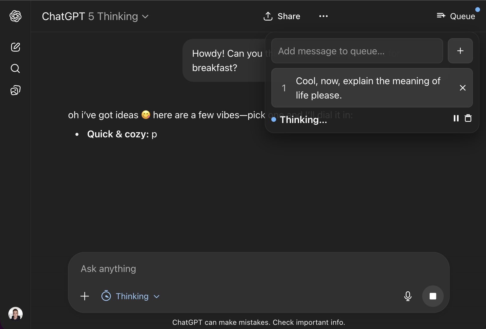

# PowerChat

> Queue up prompts for ChatGPT and Claude — they send automatically, one after another.



Ever wanted to send multiple prompts to ChatGPT or Claude without waiting and clicking "Send" after each response? PowerChat lets you **queue messages** and automatically sends the next one when the AI finishes responding.

## Why Use PowerChat?

- **Batch your prompts** — Queue up a list of questions or tasks, then walk away
- **No more babysitting** — Auto-sends the next message when the AI is ready
- **Works where you chat** — Supports ChatGPT and Claude
- **Your data stays local** — Queue is stored in your browser, nothing sent to external servers

## Install

1. Download the latest `.zip` from [**Releases**](https://github.com/Jameswlepage/powerchat/releases)
2. Unzip it
3. Go to `chrome://extensions` in Chrome
4. Turn on **Developer mode** (toggle in top right)
5. Click **Load unpacked** → select the unzipped folder
6. Go to [ChatGPT](https://chatgpt.com) or [Claude](https://claude.ai) — you'll see a **Queue** button in the header

## How to Use

| Action | How |
|--------|-----|
| **Add to queue** | Click the Queue button → type your message → click Add |
| **Quick queue** | Type in the chat box and press **Enter** (queues instead of sending) |
| **Insert newline** | **Shift+Enter** |
| **Pause/Resume** | Click ⏯ in the queue popover |
| **Clear queue** | Click 🗑 to remove all queued messages |
| **Remove one** | Click ✕ next to any queued message |

Once you have messages queued, PowerChat waits for the AI to finish responding, then automatically types and sends the next one.

## Keyboard Shortcuts

| Shortcut | Action |
|----------|--------|
| `Enter` | Queue the current message |
| `Shift+Enter` | Insert a newline |
| `Alt+Enter` | Queue (alternative) |

## FAQ

**The Queue button doesn't appear**
Reload the page. Make sure you're on `chatgpt.com`, `chat.openai.com`, or `claude.ai`.

**Messages aren't sending automatically**
The sites sometimes update their UI. If this happens, [open an issue](https://github.com/Jameswlepage/powerchat/issues) and we'll update the selectors.

**Does this work on Firefox/Safari?**
Not yet — it's Chrome-only (MV3) for now.

**Is my data safe?**
Yes. Your queue is stored locally in Chrome's storage. Nothing is sent to any server.

---

## For Developers

<details>
<summary>Project structure, building, and contributing</summary>

### File Structure
```
manifest.json   # Chrome extension manifest (MV3)
bg.js           # Background service worker (queue state per tab)
content.js      # UI injection + DOM observer + auto-send logic
content.css     # Popover and button styles
icons.js        # Inline SVG icons
```

### Install from Source
```bash
git clone https://github.com/Jameswlepage/powerchat.git
cd powerchat
```
Then load unpacked in `chrome://extensions`.

### Build
```bash
npm run build          # Creates powerchat.zip
```

### Release
```bash
npm version patch      # Bump version in package.json
npm run version        # Sync version to manifest.json
git add -A && git commit -m "chore: bump to vX.X.X"
git tag vX.X.X
git push && git push --tags
```
GitHub Actions automatically creates a release with the `.zip` attached.

### How It Works
- Watches for the "Stop" button to detect when the AI is thinking
- When thinking ends, pulls the next message from the queue and sends it
- Queue persists per-tab via `chrome.storage.local`

### Customizing Selectors
If ChatGPT or Claude updates their UI, you may need to tweak the selectors in `content.js`. The script auto-detects which site you're on based on the hostname.

</details>

## License

MIT
